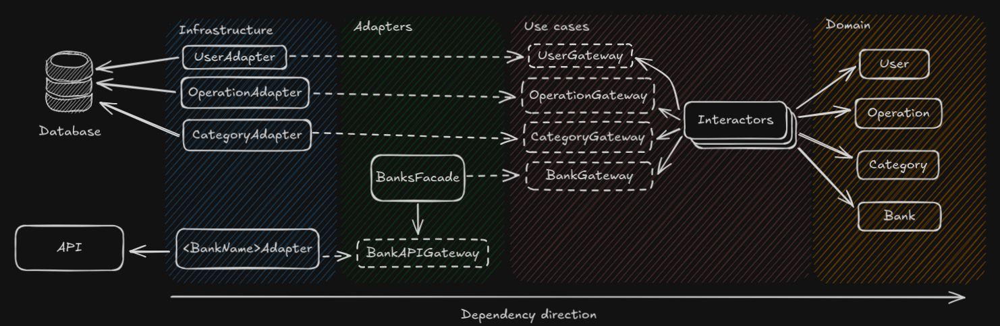

      

     
     
   

  **Costy** is a Python-based application designed for analyzing and managing users' financial expenditures. Built with a focus on technical excellence and maintainability, the project employs **Clean Architecture**, providing a solid foundation for scalability, testability, and ease of maintenance.

## Key Features

- **Core Frameworks**:
  - **[Litestar](https://litestar.dev/)**: Fast, asynchronous web framework for handling API requests efficiently.
  - **[SQLAlchemy](https://www.sqlalchemy.org/)**: ORM and database toolkit for seamless interaction with the database layer.
  - **[Dishka](https://github.com/reagento/dishka)**: A lightweight dependency injection framework to manage application dependencies cleanly.
  - **[Adaptix](https://github.com/reagento/adaptix)**: Advanced data parsing and serialization tool.

- **Clean Architecture**:
  Clean Architecture emphasizes separating the core logic of the application from external dependencies, enabling:
  - **Improved Testability**: Ensures logic is independent of frameworks or databases.
  - **Ease of Maintenance**: Changes in one dependency (e.g., database) do not ripple through the entire application.
  - **Scalability**: Designed to evolve with growing business requirements.

- **High Test Coverage**:
  Costy maintains **high test coverage**, ensuring reliability and minimizing regressions.

- **High type matching and good code style** (verified by mypy --strict and ruff)
- **Implemented Kubernetes configuration** by Helm chart

 Architecture of project:

